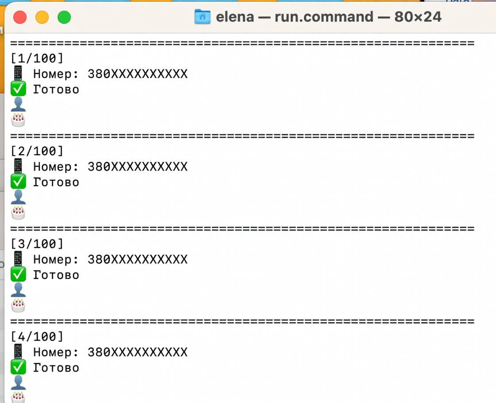

# Telegram + Python Automation / ETL Pipeline

Python-проєкт для автоматизації обробки списку вхідних значень через Telegram-інтеграцію та збереження результатів у Excel.

> **Portfolio / safety note:** репозиторій навмисно не містить реальних номерів телефонів, Telegram-сесій, API credentials або HTML-відповідей із персональними даними. Інтеграції слід використовувати лише з дозволеними джерелами та відповідно до чинного законодавства і правил сервісів.

## Що демонструє проєкт

- Python automation;
- асинхронну роботу з Telegram через Telethon;
- ETL-підхід: **Extract → Transform → Load**;
- читання та оновлення Excel через `openpyxl`;
- HTML parsing через BeautifulSoup + lxml;
- конфігурацію через environment variables;
- обробку помилок;
- збереження результату після кожного запису;
- CLI-запуск на macOS через `run.command`.

## Архітектура

```text
Excel input
    │
    ▼
excel.py ──► parser.py ──► Telegram / external source
    │               │
    │               └──► HTML parsing
    ▼
Excel output
```

### Файли

| File | Purpose |
|---|---|
| `main.py` | Entry point, Telegram client lifecycle |
| `excel.py` | Input/output layer for Excel |
| `parser.py` | External-source adapter and HTML parsing |
| `helpers.py` | Text-processing utilities |
| `config.py` | Environment-based configuration |
| `.env.example` | Safe configuration template |
| `run.command` | macOS launcher |
| `requirements.txt` | Python dependencies |

## ETL flow

### 1. Extract

Input rows are read from an Excel file. In live mode, the pipeline can send an input value to a configured Telegram bot and receive a response artifact.

### 2. Transform

The response is converted from HTML into structured metadata. The public example deliberately limits the extracted fields to non-sensitive operational metadata such as processing status and source.

### 3. Load

Results are written back to the Excel workbook after every processed row. This reduces the risk of losing completed work if the process stops unexpectedly.

## Demo mode

The repository starts in `DEMO_MODE=true`, so it can be demonstrated without Telegram credentials or network access.

### Setup

```bash
python3 -m venv .venv
source .venv/bin/activate
pip install -r requirements.txt
cp .env.example .env
python3 main.py
```

The demo expects an Excel file at `data/phones.xlsx`. For a quick test, create a workbook with a first column named `phone` and add synthetic values.

For example:

```text
phone
+380XXXXXXXXX
+380YYYYYYYYY
```
## Demo

Example of the automation pipeline running locally:



## Live integration

For an authorized integration:

1. Set `DEMO_MODE=false` in `.env`.
2. Add Telegram credentials to `.env`.
3. Set the approved bot name.
4. Keep the generated `.session` file local.
5. Never commit `.env`, session files, real input datasets, or response HTML to GitHub.

## Security checklist

- [x] Credentials moved to environment variables.
- [x] Telegram session files ignored by Git.
- [x] Real Excel datasets excluded from Git.
- [x] HTML response artifacts excluded from Git.
- [x] Logs excluded from Git.
- [x] Demo mode available without credentials.
- [x] No real personal data included in the portfolio repository.

## Skills demonstrated

**Python · AsyncIO · Telethon · openpyxl · BeautifulSoup · lxml · ETL · Automation · Excel · Environment Variables · Error Handling · Git/GitHub**

## Possible improvements

- structured logging with Python `logging`;
- retry/backoff strategy;
- configurable rate limits;
- unit tests for parsing and Excel transformations;
- typed data models with `dataclasses` or Pydantic;
- Dockerized execution;
- CI checks with GitHub Actions.
